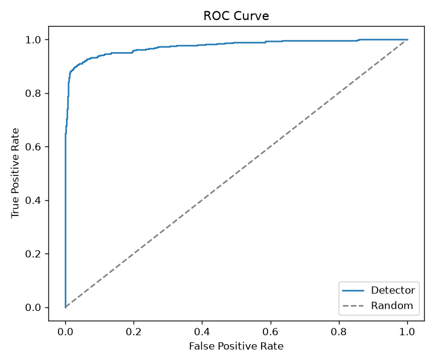
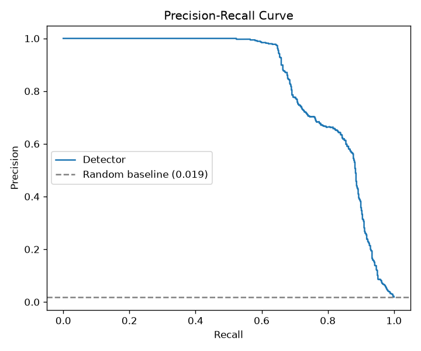
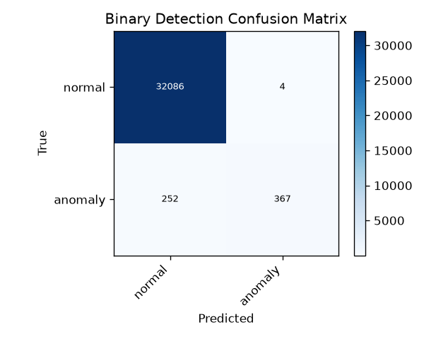
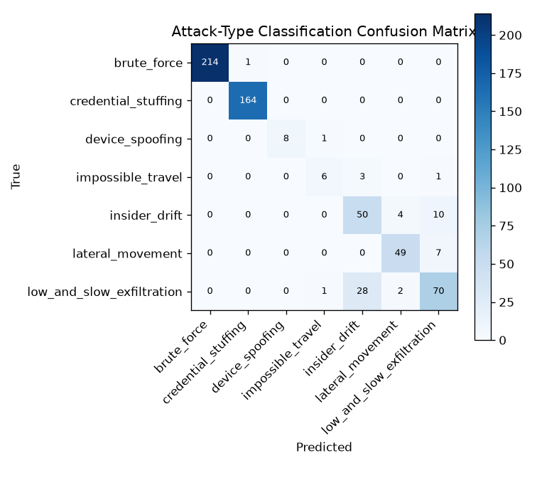
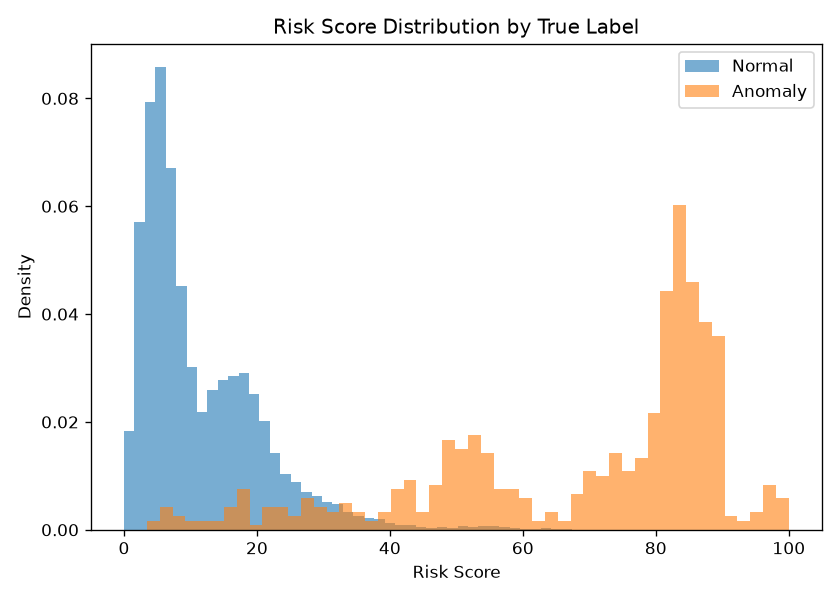
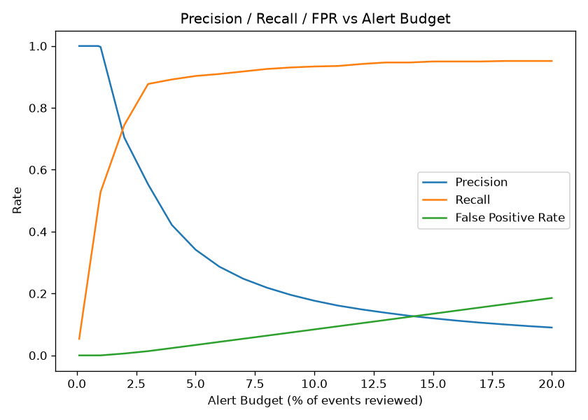

# AI-Powered Behavioral Anomaly Detection for Cybersecurity

An AI/ML system that learns what "normal" login and access behavior looks like for every user, service account, and device — then flags the moment something breaks that pattern, names the specific type of attack, and explains why in plain language.

Built for the **Honeywell Campus Hiring Challenge** by **Mounvik Karnati**.

---

## Problem Statement

Traditional signature-based security only catches attacks it already knows about. It misses novel or slow, low-and-slow intrusions completely. The brief asked for a system that instead learns *behavior* — timing, location, access patterns, device fingerprints — and flags deviations, while handling five specific challenges:

1. **Sequential data** — access events unfold over time, not as single snapshots
2. **Extreme class imbalance** — true intrusions are a tiny fraction of all traffic
3. **Concept drift** — legitimate behavior changes (new role, new device) and shouldn't stay flagged forever
4. **Explainability** — an analyst needs to know *why* something was flagged, not just a score
5. **Cold-start problem** — brand-new users or devices have no history to compare against

## Solution

A complete, working pipeline — not a notebook, not a mockup:

**Synthetic data generator** → **Isolation Forest detector** → **Random Forest classifier** → **SHAP explainability** → **live analyst dashboard**

Every access event is scored against that specific entity's own recent behavior (not a global average), flagged if it's a statistical outlier, classified into one of 7 attack types, and explained with an exact feature-level reason — end to end, with one command.

## Features

- **330 simulated entities** (users, service accounts, edge devices), each with a distinct, realistic behavioral profile
- **109k+ access-log sessions** generated with controlled anomaly injection (~2% attack rate)
- **7 attack types detected and classified**: brute force, credential stuffing, impossible travel, device spoofing, lateral movement, low-and-slow exfiltration, insider drift
- **Rolling 5-day behavioral baseline** per entity — automatically forgets stale behavior, handles concept drift with no manual retraining
- **Peer-group fallback** for cold-start entities with no history
- **Dual explainability** on every alert — plain-language deviation summary *and* exact SHAP feature attribution
- **Hybrid detection** — statistical model plus a targeted rule layer that catches what the statistics alone missed (see *Honest Findings* below)
- **Live analyst dashboard** — ranked alert queue, live event replay, world map, entity history, device trust view, model evaluation panel
- **Fully automated pipeline** — one command regenerates data, retrains models, populates alerts, and rebuilds this documentation from live results

## Tech Stack

| Layer | Tools |
|---|---|
| Language | Python 3 |
| Data generation | NumPy, Python `random`, Faker |
| Data handling | pandas |
| Backend / API | FastAPI, SQLite |
| Detection model | scikit-learn — Isolation Forest (unsupervised) |
| Classification model | scikit-learn — Random Forest |
| Explainability | SHAP (`TreeExplainer`) + custom rule-based reasoning |
| Dashboard | React (CDN, no build step), Plotly |
| Report automation | Python → Markdown → pandoc → LibreOffice |

## How the Synthetic Data Is Built

Real intrusion datasets are scarce or privacy-locked, so the generator builds its own:

- Each entity gets a randomly assigned but internally consistent behavioral profile (typical login hours, home location, usual resources, known devices) — seeded with `random.seed(42)` / `np.random.seed(42)` for full reproducibility
- Daily session counts are drawn from a **Poisson distribution** (`numpy.random.poisson`) to mimic natural login-frequency variance
- Session durations are drawn from a **log-normal distribution** (`numpy.random.lognormal`), since real session lengths are right-skewed
- IPs, MAC addresses, and device fingerprints are generated with **Faker**, not hard-coded placeholders
- The 7 attack patterns are injected using `random.choices` with weighted probabilities, so common attacks (brute force) appear more often than rare ones (device spoofing) — matching real-world attack-frequency distributions
- Ground-truth labels are kept in a **separate file**, never exposed to the detection model — mirrors how a real deployment has no advance knowledge of which events are attacks

## Architecture


## Model Pipeline


## Model Evaluation

Tested on a held-out chronological split (108,986 sessions, 330 entities):

| Metric | Result |
|---|---|
| Precision | 99.7% |
| Recall | 58.2% |
| F1 Score | 0.735 |
| False Positive Rate | 0.003% |
| Alerts generated | 1,971 |

<table>
  <tr>
    <td align="center">
      <b>ROC Curve</b><br>
      
    </td>
    <td align="center">
      <b>Precision-Recall Curve</b><br>
      
    </td>
  </tr>

  <tr>
    <td align="center">
      <b>Binary Detection Confusion Matrix</b><br>
      
    </td>
    <td align="center">
      <b>Attack-Type Classification Confusion Matrix</b><br>
      
    </td>
  </tr>

  <tr>
    <td align="center">
      <b>Risk Score Distribution (Normal vs. Anomaly)</b><br>
      
    </td>
    <td align="center">
      <b>Precision / Recall / False Positive Rate vs. Alert Budget</b><br>
      
    </td>
  </tr>
</table>

## Demo

Screenshots of the live analyst dashboard, one per panel:

**Alert Queue**


**Live Feed**


**World Map**


**Entity Explorer**


**Device Trust**


**Model Evaluation**


## Honest Findings

Loud, structurally distinctive attacks (brute force, credential stuffing, device spoofing) are caught 95–100% of the time. Quiet, gradual ones (lateral movement, low-and-slow exfiltration, insider drift) are caught far less often in the full alert queue — a known limitation of a detector tuned to an overall 2% base rate rather than per attack type. We found this ourselves mid-build (the statistical model alone missed 100% of true device-spoofing cases) and fixed it with a targeted rule layer rather than hiding the gap.

## Getting Started

```bash
git clone https://github.com/mounvikkarnati/Honeywell_Hackathon.git
cd Honeywell_Hackathon
python3 -m venv .venv
source .venv/bin/activate
pip install -r requirements.txt

# Run the entire pipeline — generate data, train models, populate alerts
python3 -m run_pipeline

# Start the dashboard
uvicorn backend.app:app --reload --port 8000
```

Open `http://localhost:8000/` for the dashboard, or `http://localhost:8000/docs` for the raw API.

## Project Structure

```
generator/     synthetic data generator + attack injection
backend/       FastAPI + database + live event streaming
ml/            profiler, feature engineering, detector, classifier, explainability
evaluation/    standalone metrics/plots module
frontend/      analyst dashboard
report/        automated report generator
run_pipeline.py       one-command full pipeline
verify_pipeline.py    automated end-to-end attack-coverage check
```

## Author

**Mounvik Karnati**
[github.com/mounvikkarnati/Honeywell_Hackathon](https://github.com/mounvikkarnati/Honeywell_Hackathon)
